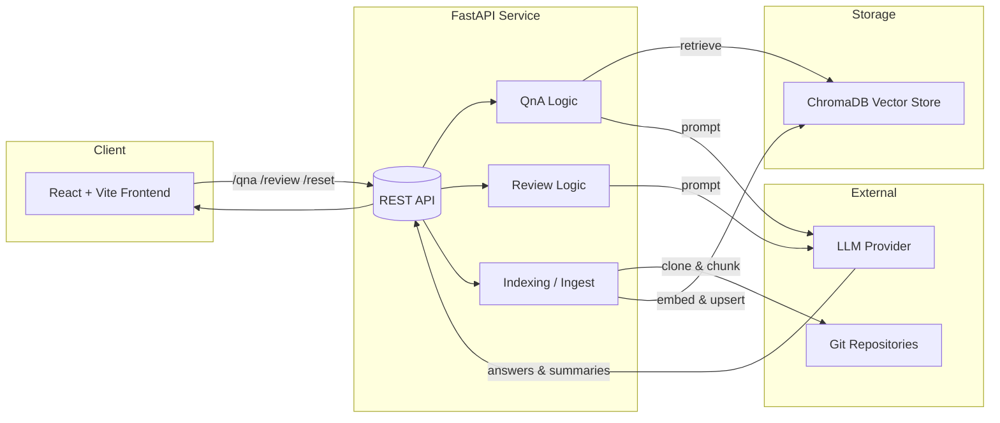

### AI Code Review & QnA Agent

Transform how you understand and improve codebases. This project provides a FastAPI backend that indexes repositories into a vector database (ChromaDB) and a modern React (Vite) frontend to ask natural‑language questions (QnA) and run automated code reviews with optional auto‑fixes.

---

### Tech stack

[](https://fastapi.tiangolo.com/) 
[](https://www.python.org/) 
[](https://www.trychroma.com/) 
[](https://python.langchain.com/) 
[](https://huggingface.co/docs/transformers/index) 
[](https://react.dev/) 
[](https://vitejs.dev/) 
[](https://tailwindcss.com/) 
[](https://www.docker.com/) 
[](https://nodejs.org/)

---

### Why this exists (STAR method)

- **Situation**: Teams spend significant time onboarding to unfamiliar repos, extracting knowledge buried in READMEs and source files, and running repetitive review checks.
- **Task**: Build a system that can ingest a repository, answer QnA about it, and perform lint- and heuristics‑driven code reviews with LLM summarization.
- **Action**: Implemented a FastAPI service that indexes repos into ChromaDB, exposes QnA and Review endpoints, and a React UI for a frictionless experience. Integrated LLM prompts, repo cloning, chunking, and retrieval.
- **Result**: Faster onboarding, clearer insights, and a repeatable code review workflow. Teams can query repos like a knowledge base and run quick quality passes, cutting time spent on manual triage.

---

### Features

- **QnA over a repo**: Ask natural‑language questions; gets contextual answers with top source chunks.
- **Automated code review**: Run a review on a repo (or staged changes), with optional auto‑fix formatting.
- **Persistent vector store**: Uses ChromaDB to store and retrieve relevant code/README chunks.
- **Modern UI**: React + Vite frontend with a polished interface and CORS‑enabled backend.

---

### Architecture at a glance

- Backend: `FastAPI` (`app/main.py`) + `uvicorn`
- Vector store: `ChromaDB`
- LLM plumbing: `langchain`, `transformers`, `sentence-transformers`
- Frontend: `React` + `Vite`

Key backend modules:

- `app/main.py`: FastAPI app and REST endpoints (`/qna`, `/review`, `/reset`, `/health`)
- `app/agent.py`: LLM invocation and code review orchestration
- `app/indexer.py`, `app/ingest.py`, `app/simple_indexer.py`: Repo ingestion/index workflows
- `app/qna.py`, `app/review.py`: QnA preparation and review logic

#### Diagram



---

### Prerequisites

- Python 3.11+
- Node.js 18+ (for the frontend)
- An LLM provider key exposed as `OPENAI_API_KEY` (or adapt `app/agent.py` to your provider)

---

### Quickstart (local, mirrors your usual steps)

Backend (FastAPI):

```powershell
# from repo root
python -m venv venv
./venv/Scripts/Activate.ps1
pip install --upgrade pip
pip install -r requirements.txt

$env:OPENAI_API_KEY="sk-..."    # set your key
$env:CHROMA_DB_DIR="./chroma_db" # optional; default is used if omitted

cd app
uvicorn main:app --reload
# Backend served at http://localhost:8000
```

Frontend (Vite + React):

```powershell
# new shell or split terminal
./venv/Scripts/Activate.ps1
cd frontend
npm install
npm run dev
# Frontend served at http://localhost:5173
```

> CORS in `app/main.py` already allows `http://localhost:5173`.

---

### QnA: the easiest local path

If you only want to ask questions about a repo quickly:

1. Start backend:
   - Create and activate venv, install deps, set `OPENAI_API_KEY`.
   - `cd app` and run `uvicorn main:app --reload`.
2. Start frontend:
   - `cd frontend` and run `npm install && npm run dev`.
3. In the UI:
   - Paste the repo URL (public Git URL).
   - Type your question and press Enter.

That’s it — indexing and retrieval happen on demand; answers include top matching source chunks.

---

### Run with Docker Compose

The repository includes a minimal compose file that runs the backend container. You can keep running the frontend locally with `npm run dev` for fast HMR.

```powershell
# from repo root
$env:OPENAI_API_KEY="sk-..."
docker compose up --build

# Backend at http://localhost:8000
# Frontend (run locally): http://localhost:5173
```

If you prefer a two‑service compose (backend + frontend dev server), adapt the compose to add a `frontend` service that runs `npm run dev -- --host` and bind `5173:5173`.

---

### Configuration

- **OPENAI_API_KEY**: Required to call the LLM provider.
- **CHROMA_DB_DIR**: Directory where ChromaDB stores vectors. Defaults to `./chroma_db`. In containers you may mount it to persist across runs.
- Optional cache (if you extend compose): map `TRANSFORMERS_CACHE` to reuse model assets across runs.

---

### API overview

Base URL: `http://localhost:8000`

- `GET /health`
  - Returns simple status `{ "status": "ok" }`.

- `POST /qna`
  - Body: `{ "repo_url": string, "query": string, "top_k"?: number }`
  - Returns: `{ "answer": string, "top_chunks": Array<object> }`

- `POST /review`
  - Body: `{ "repo_url": string, "staged"?: boolean, "auto_fix"?: boolean }`
  - Returns: `{ "summary": object, "events": object[], "formatted": string }`

- `POST /reset`
  - Body: `{ "repo_url": string }`
  - Resets the ChromaDB collection for the repo.

Example (PowerShell):

```powershell
Invoke-RestMethod -Method Post -Uri "http://localhost:8000/qna" -ContentType "application/json" -Body (@{
  repo_url = "https://github.com/owner/repo";
  query    = "How do I run the service?";
} | ConvertTo-Json)
```

---

### Use cases

- **Onboarding to a new codebase**: Ask “Where is auth handled?” or “How do I run migrations?”
- **Design discovery**: Trace architectural patterns by querying modules and their responsibilities.
- **Lightweight reviews**: Run an automated review for style or structure hints before opening a PR.
- **Release prep**: Summarize recent changes and catch obvious issues quickly.
- **Knowledge base**: Treat the repo as a searchable knowledge source with contextual answers.

---

### Frontend usage

1. Open `http://localhost:5173`.
2. Paste a Git repo URL into the input.
3. For QnA: type your question and press Enter.
4. For Review: toggle "Enable Auto Fix" if desired and click "Run Review".
5. Use "Reset DB" to clear the indexed collection for the current repo.

---

### Project structure

```text
.
├─ app/
│  ├─ main.py                 # FastAPI app & endpoints
│  ├─ agent.py                # LLM calls & review orchestration
│  ├─ indexer.py, ingest.py   # Indexing & repo ingestion
│  ├─ qna.py, review.py       # QnA and review helpers
│  └─ ...
├─ frontend/                  # React + Vite UI
├─ chroma_db/                 # Local ChromaDB data (if running locally)
├─ docker/                    # Dockerfile(s)
├─ docker-compose.yaml        # Backend compose (minimal)
├─ requirements.txt           # Python deps
└─ README.md
```

---

### Troubleshooting

- "CORS" errors: Ensure you are using `http://localhost:5173` (already allowed in `app/main.py`).
- Model downloads slow: Use a cache volume for `TRANSFORMERS_CACHE` when containerizing.
- Repo indexing fails: Confirm the repo URL is reachable and `git` is installed in your environment.
- Windows PowerShell quoting: Prefer double quotes for env var assignment, e.g. `$env:OPENAI_API_KEY="sk-..."`.

---

### Roadmap (ideas)

- Provider‑agnostic LLM interface and key management
- Auth + multi‑user workspaces
- Advanced review rulesets and PR comments integration
- Vector store sharding and background indexing jobs

---

### License

This project is released under the MIT License. See `LICENSE` for details.


